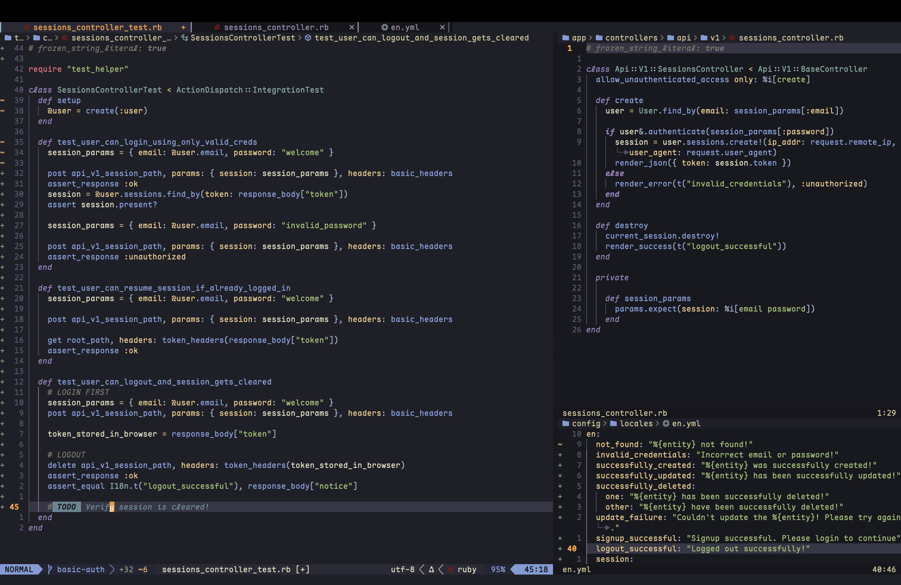

# Intro

My macOs dotfiles is a product of my effort towards creating a sensible, and mostly terminal based productive environment which I can use to conquer my daily dev works. Looking back, in the last few years, some of the major jumps I have made are from `zsh -> fish`, `vim -> vscode -> neovim+tmux` and `urxvt -> ghostty`. I have grown over the mindset of being a `ricer` towards a more `productive` mindset, where, I only make changes that help me be more productive. Thus, I don't call myself a "ricer" nor a "minimalist" anymore!

Over the years, I have come to a realisation that I don't change my system/OS often. Thus I don't need to use any fancy dotfiles manager to get things done. Just barebones `git` and some scripts does the job!

## How to use this repo?

I would recommend that you cherry pick the configs that you feel might add benefit to your setup.

### My tooooolzzzz/warezzzz...

- ghostty
- neovim(release version)
- tmux
- fzf(works in yazi too)
- rg
- fd
- yazi(i also use this inside neovim instead of neo-tree)

Rest of the configs can be found in `.config`. Checkout `Brewfile`  and `.gemlist` files if you want to know more about specific stuff I use.

## Screenshots

- "Cleanliness is all..."

- A sample workflow where I am writing backend tests in Rails in my tmux sesh with `entr` running the tests:

- Neovim - simple, elegant, fast!

- Yazi - I hop file managers from time to time. Sticking with Yazi for now.

## TODO

- [] Add a script to automatically sync changes to dotfiles as part of `upd` function
- [] Add a script to stow things to place. This is low priority since I don't switch systems often.
- [] Rick roll somewhere...
