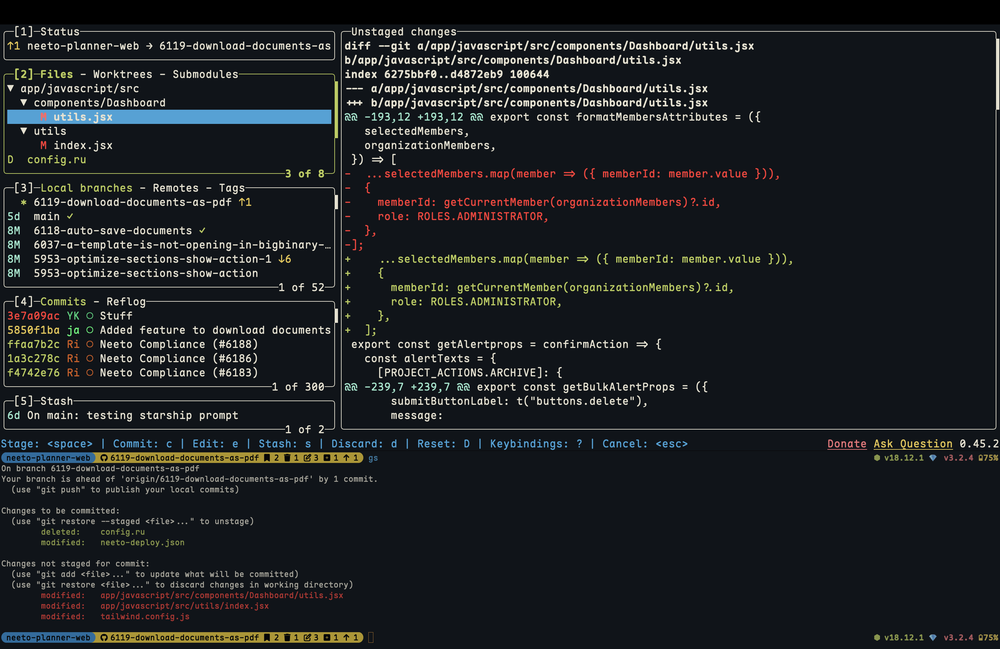

# Intro

These macOS dotfiles are the culmination of my ongoing quest to craft a sensible, mostly terminal-based dev environment — because if I’m gonna stare at a screen all day, it better be efficient. Over the years, I've undergone several evolutionary leaps:

- `linux → macOs`: such is life - but no complaints whatsoever - more productive i'd say.
- `zsh → fish`: because who doesn't like autocompletions that feel like mind-reading? Plus my zsh env was becoming slow af.
- `vim → vscode → neovim+tmux`: went full circle but landed back at a place which feels like home.
- `urxvt/st → ghostty`: because bare metal performance in macOs plus smart memory consumption matters! A newly opened terminal should display it's prompt under 1 second, and Ghostty does that elegantly.

Once upon a time, I was a proud `ricer`, tweaking every pixel and obsessing over font ligatures. But enlightenment struck — I now optimize for productivity, not just aesthetics. So, am I a ricer? Nope. A minimalist? Not quite. Just a dev who wants the fastest, smoothest workflow without unnecessary bloat.

Over the years, I have had some strong realizations:
- I don't need to use any fancy dotfiles manager like say `stow`, `yadm`, `dotbot` etc. I don't change my system/OS often. Thus just barebones `git` and some scripts gets the job done!
- I like the idea of being able to tinker and craft the tool to my needs. My terminal, neovim and tmux configs are exactly that!
- I like to try out new tools, which claims to be faster or feature-rich than the current tools that I use. For example, i tried biome over eslint+prettier and I think I will switch.
- Resisting usage of AI code writing tools in the text editor is a good way to actually be a literate programmer!

## How to use this repo?

I would recommend that you cherry pick the configs that you feel might add benefit to your setup.

### My tooooolzzzz/warezzzz...

- ghostty
- fish shell
- neovim(release version)
- tmux
- fzf(works in yazi too)
- rg
- fd
- lazygit
- yazi(i also use this inside neovim instead of neo-tree)

Rest of the configs can be found in `.config`. Checkout `Brewfile` and `.gemlist` files if you want to know more about specific stuff I use. You can install all the packages from `Brewfile` by running `brew bundle --file "./Brewfile"`.

PS: You can find my old linux dotfiles [here](old_linux_dots/).

## Screenshots

- Neofetch is not my friend anymore:

---

- A sample workflow where I am writing backend tests in Rails.

Tools shown in the above workflow:

    - tmux session with dedicated window for tasks - like a window just for running tests, a window for writing backend code etc.
    - tests are being automatically run on file change using `entr`.
    - neovim can restore its last session based on which directory we are opening it from.
        - fzf powered file searching, grepping etc.
        - ruby-lsp doing it's magic and providing us goto definition, linting etc.

---

- Neovim - simple, elegant, fast!

---

- Lazygit:

---

- Yazi - I hop file managers from time to time. Sticking with Yazi for now. Yazi also works as the file manager within Neovim.

---

- Spotify in the terminal with vim keybindings:

## TODO

- [ ] Add a script to automatically sync changes to dotfiles as part of `upd` function.
- [ ] Add a script to stow things to place. This is low priority since I don't switch systems often.
- [ ] Try out [superfile](https://github.com/yorukot/superfile) and make a switch from yazi. Follow this [tutorial](https://youtu.be/dQw4w9WgXcQ?si=MQ2ZzDoybCt6cpCt) for easy transition.
- [x] Rick roll somewhere in this repo.
